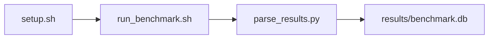

# NCCL Bandwidth Test Benchmark

[](LICENSE)
[](.github/workflows/ci.yml)

Target: Ubuntu 24.04 · NVIDIA · see Hardware Requirements. This is a host benchmark, not a laptop `pip install` project.

## Quick Start

```bash
git clone https://github.com/garys-gpu-benchmarks/216-gpu-bench-nvidia-nccl-bandwidth-test-ubu2404.git
cd 216-gpu-bench-nvidia-nccl-bandwidth-test-ubu2404
sudo bash setup.sh --assume-yes
bash run_benchmark.sh --profile smoke --validate
```
Results are written to `results/benchmark.db` and `results/summary.json`.

This workload is executed on the validation host after the repository is copied there. `setup.sh` and `run_benchmark.sh` do not open an outbound SSH session.

Prerequisites: Ubuntu 24.04; NVIDIA; Python 3.12.3; root or sudo for `setup.sh`. Framework: Bash, SQLite, Python, PyYAML, CUDA Runtime, NVCC, NCCL. This is a host benchmark, not a laptop `pip install` project.



## 1. Overview

Builds src/nccl_bw.cu and runs bin/nccl_bw for each yaml collective over message sizes from min_bytes to max_bytes by step_factor. num_gpus: GPUs in the communicator (capped at the GPUs present, max 8). collective: comma-separated all_reduce, all_gather, broadcast, reduce, reduce_scatter. warmup_iters and num_iterations time each size Sweep dimensions: num_gpus, collective, min_bytes, max_bytes, step_factor, warmup_iters, num_iterations.

## 2. What It Validates

- Validates NCCL collective bandwidth and latency across the GPUs in the communicator. On one GPU the three metrics are na (requires at least two GPUs)
- #1: Bus bandwidth at max message size, GB/s (busbw_gb_s); is present and physically sensible.
- #2: Algorithm bandwidth at max message size, GB/s (algbw_gb_s); is present and physically sensible.
- #3: Latency at min message size, us (latency_us) is present and physically sensible.

## 3. Metrics Captured

- **#1: Bus bandwidth at max message size, GB/s** — stored as `busbw_gb_s`.
- **#2: Algorithm bandwidth at max message size, GB/s** — stored as `algbw_gb_s`.
- **#3: Latency at min message size, us** — stored as `latency_us`.

## 4. Hardware Requirements

### Supported environment

- OS: Ubuntu 24.04
- GPU vendor: NVIDIA
- Framework family: Bash, SQLite, Python, PyYAML, CUDA Runtime, NVCC, NCCL
- Python: Python 3.12.3

### Reference validation environment

The tables below describe the machine used to generate the reference results. They are not a requirement that every user buy that exact cloud instance.

### System

Builds src/nccl_bw.cu and runs bin/nccl_bw for each yaml collective over message sizes from min_bytes to max_bytes by step_factor. num_gpus: GPUs in the communicator (capped at the GPUs present, max 8). collective: comma-separated all_reduce, all_gather, broadcast, reduce, reduce_scatter.

### GPU

Ubuntu 24.04 / NVIDIA / Bash, SQLite, Python, PyYAML, CUDA Runtime, NVCC, NCCL

## 5. Software Requirements

| Component | Version |
|---|---|
| OS | Ubuntu 24.04 |
| Kernel | kernel 6.8.0 |
| Python | Python 3.12.3 |
| ROCm | CUDA 12.8 |
| rocBLAS | N/A - rocBLAS not used |

Builds src/nccl_bw.cu and runs bin/nccl_bw for each yaml collective over message sizes from min_bytes to max_bytes by step_factor. num_gpus: GPUs in the communicator (capped at the GPUs present, max 8). collective: comma-separated all_reduce, all_gather, broadcast, reduce, reduce_scatter.

## 6. Installation

```bash
Compile nccl_bw.cu with nvcc and NCCL; run bin/nccl_bw <min_bytes> <warmup> <iters> <num_gpus> <collective>
```

## 7. Running the Benchmark

```bash
Compile nccl_bw.cu with nvcc and NCCL; run bin/nccl_bw <min_bytes> <warmup> <iters> <num_gpus> <collective>
```

**Validating results separately:**

```bash
export BENCHMARK_PYTHON=/usr/bin/python3.13  # optional
python3 -m venv .venv
source ".venv/bin/activate"
".venv/bin/python" scripts/validate_results.py
```

## 8. Output

### `results/benchmark.db` (SQLite)

NCCL all_reduce stdout plus one CSV row. Column order is busbw then algbw. A single row is duplicated to two samples

sample_index,status,collective,num_gpus,bytes,busbw_gb_s,algbw_gb_s,latency_us,error_message
0,ok,all_reduce,1,1024,na (requires at least two GPUs),na (requires at least two GPUs),na (requires at least two GPUs),

```bash
Compile nccl_bw.cu with nvcc and NCCL; run bin/nccl_bw <min_bytes> <warmup> <iters> <num_gpus> <collective>
```

### `results/summary.json`

Consolidated metrics from the most recent run — suitable for CI artifact upload or dashboard ingestion.

### `results/raw/<timestamp>.txt`

NCCL all_reduce stdout plus one CSV row. Column order is busbw then algbw. A single row is duplicated to two samples

sample_index,status,collective,num_gpus,bytes,busbw_gb_s,algbw_gb_s,latency_us,error_message
0,ok,all_reduce,1,1024,na (requires at least two GPUs),na (requires at least two GPUs),na (requires at least two GPUs),

## 9. Baselines / Thresholds

Expected ranges and gates live in `config/benchmark_config.yaml` under `baselines:` or `thresholds:`. To update them, edit that file — never edit validation code directly.

## 10. Troubleshooting

**`setup.sh` missing collector**
Create cannot finish without `scripts/collect_workload.py`.

**`self_check` overlay rewritten**
Do not overwrite files listed in `results/overlay_lock.json`.

**Remote SSH drop during setup**
Reconnect and resume `bash setup.sh --assume-yes`. Do not wipe `.venv` or `.cache`.

## 11. NVIDIA H100 Coding Differences

Native NVIDIA CUDA workload. Execute on the stated Ubuntu release with the host NVIDIA driver and CUDA userspace. ROCm porting notes do not apply.

## Repository layout

```text
.
├── setup.sh
├── run_benchmark.sh
├── benchmark_specification.json
├── config/
├── scripts/
├── src/
├── tests/
├── docs/
├── results/
└── LICENSE
```
